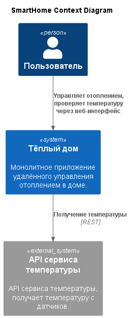
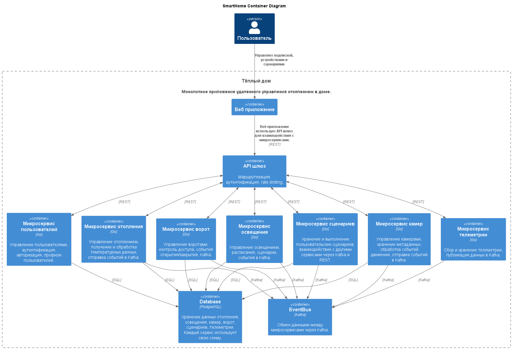

# Задание 1. Анализ и планирование

## 1. Описание функциональности монолитного приложения

**Управление отоплением:**

- Пользователи включают/отключают отопление через web-клиент.

**Мониторинг температуры:**

- Пользователи проверяют температуру через web-клиент;
- Система получает данные о температуре с датчиков;
- Система поддерживает добавление, обновление и удаление датчиков;

## 2. Анализ архитектуры монолитного приложения

- Язык программирования: Go;
- База данных: PostgreSQL;
- Архитектура: Монолит;
- Взаимодействие: Синхронное;
- Масштабируемость: Ограничена, масштабируется целиком.
- Развертывание: Требует остановки приложения.

## 3. Определение доменов и границы контекстов

### Управление устройствами

- Подключение, регистрация, настройка и удаление устройств.

### Управление отоплением

- Управление модулями отопления (вкл/выкл, настройка температуры);
- Получение данных о температуре с датчиков;
- Логика работы с отоплением и температурой.

### Управление пользователями

- Доступ к управлению отопления и просмотру температуры.

## 4. Проблемы монолитного решения

- Плохая масштабируемость, увеличении нагрузки на один компонент системы, требует общего масштабирования;
- Сложность внедрения новых функций, обновление одного компонента ведет обновление и перезапуск всей системы;
- Высокая вероятность ошибки при редактировании кода;
- Сложный погружение новых сотрудников в приложение.

## 5. Визуализация контекста системы — диаграмма С4



# Задание 2. Проектирование микросервисной архитектуры

## Диаграмма контейнеров (Containers)



## Диаграмма компонентов (Components)

Пример диаграммы компонентов на контейнере "Управление устройствами"


## Диаграмма кода (Code)

Пример диаграммы кода компонента "Управление отоплением"


# Задание 3. Разработка ER-диаграммы

Пример ER-диаграммы для отопления


# Задание 4. Создание и документирование API

### 1. Тип API

Укажите, какой тип API вы будете использовать для взаимодействия микросервисов. Объясните своё решение.

### 2. Документация API

Здесь приложите ссылки на документацию API для микросервисов, которые вы спроектировали в первой части проектной работы. Для документирования используйте Swagger/OpenAPI или AsyncAPI.


# Задание 5. Работа с docker и docker-compose

Перейдите в apps.

Там находится приложение-монолит для работы с датчиками температуры. В README.md описано как запустить решение.

Вам нужно:

1. сделать простое приложение temperature-api на любом удобном для вас языке программирования, которое при запросе /temperature?location= будет отдавать рандомное значение температуры.

Locations - название комнаты, sensorId - идентификатор названия комнаты

```
	// If no location is provided, use a default based on sensor ID
	if location == "" {
		switch sensorID {
		case "1":
			location = "Living Room"
		case "2":
			location = "Bedroom"
		case "3":
			location = "Kitchen"
		default:
			location = "Unknown"
		}
	}

	// If no sensor ID is provided, generate one based on location
	if sensorID == "" {
		switch location {
		case "Living Room":
			sensorID = "1"
		case "Bedroom":
			sensorID = "2"
		case "Kitchen":
			sensorID = "3"
		default:
			sensorID = "0"
		}
	}
```

2. Приложение следует упаковать в Docker и добавить в docker-compose. Порт по умолчанию должен быть 8081

3. Кроме того для smart_home приложения требуется база данных - добавьте в docker-compose файл настройки для запуска postgres с указанием скрипта инициализации ./smart_home/init.sql

Для проверки можно использовать Postman коллекцию smarthome-api.postman_collection.json и вызвать:

- Create Sensor
- Get All Sensors

Должно при каждом вызове отображаться разное значение температуры

Ревьюер будет проверять точно так же.
