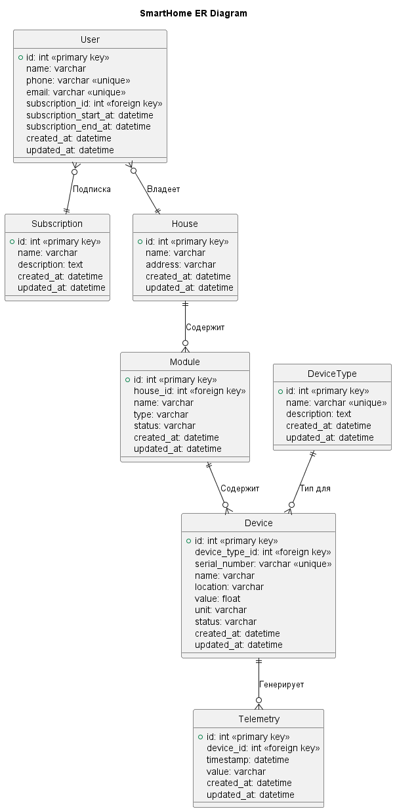

# Задание 1. Анализ и планирование

## 1. Описание функциональности монолитного приложения

**Управление отоплением:**

- Пользователи включают/отключают отопление через web-клиент.

**Мониторинг температуры:**

- Пользователи проверяют температуру через web-клиент;
- Система получает данные о температуре с датчиков;
- Система поддерживает добавление, обновление и удаление датчиков;

## 2. Анализ архитектуры монолитного приложения

- Язык программирования: Go;
- База данных: PostgreSQL;
- Архитектура: Монолит;
- Взаимодействие: Синхронное;
- Масштабируемость: Ограничена, масштабируется целиком.
- Развертывание: Требует остановки приложения.

## 3. Определение доменов и границы контекстов

### Управление устройствами

- Подключение, регистрация, настройка и удаление устройств.

### Управление отоплением

- Управление модулями отопления (вкл/выкл, настройка температуры);
- Получение данных о температуре с датчиков;
- Логика работы с отоплением и температурой.

### Управление пользователями

- Доступ к управлению отопления и просмотру температуры.

## 4. Проблемы монолитного решения

- Плохая масштабируемость, увеличении нагрузки на один компонент системы, требует общего масштабирования;
- Сложность внедрения новых функций, обновление одного компонента ведет обновление и перезапуск всей системы;
- Высокая вероятность ошибки при редактировании кода;
- Сложный погружение новых сотрудников в приложение.

## 5. Визуализация контекста системы — диаграмма С4

# Задание 2. Проектирование микросервисной архитектуры

## Диаграмма контейнеров (Containers)

## Диаграмма компонентов (Components)

Пример диаграммы компонентов на контейнере "Управление устройствами"

## Диаграмма кода (Code)

Пример диаграммы кода компонента "Управление отоплением"

# Задание 3. Разработка ER-диаграммы

Пример ER-диаграммы для отопления

# Задание 4. Создание и документирование API

## 1. Тип API - REST API

Проще и лучше подходит под микросервисную архитектуру.

## 2. Документация API для микросервиса "Управления отоплением"

[Посмотреть документацию API](apps/openapi/version_2025-06-15.yaml)

# Задание 5. Работа с docker и docker-compose

Путь до приложения temperature-api: apps\temperature
Путь до Dockerfile приложения temperature-api: apps\temperature\Dockerfile
Путь до docker compose: apps\docker-compose.yml
Скрипт инициализации для БД: apps\postgres-init\init.sql, монтируется к контейнеру с БД

Для проверки добавил папку curls: apps\curls
